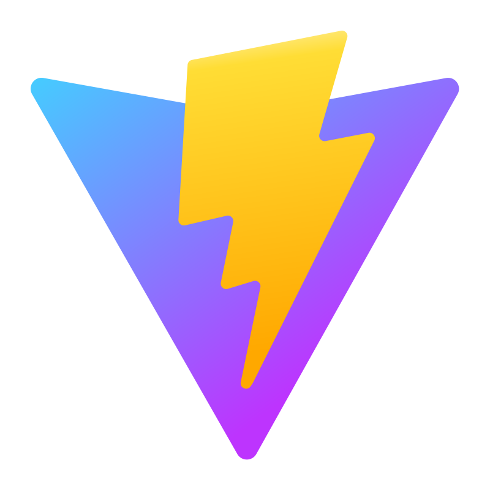

# About-me 🤓

👋 Hello, my name is Wendell Bitencourt.
 
 
Software Engineer with a degree in Computer Science.

Since 2019 I have been working professionally in the technology area.

I am a curious, creative and analytical person.

"Do your best with what you have, until you can do better with better means!" - Mario Sergio Cortella
 
 
**📫 How to reach me:**
 
 

 
 
 

**Main languages and tools:**

<h5>I have experience</h6>

    <h6>General</h6>
    

        
        
        
        
    

     
     
     
    

        
        
        
        
    

     
     
     
    

        
    

 
 
 

    <h6>Frontend</h6>
    

        
        
        
        
    

     
     
     
    

        
        
        
         
    

 
 
 
    

        
        
    

 
 
 

    <h6>Backend/DevOps</h6>
    

        
        
        
        
    

     
     
     
    

        
            
        
        
    

 
 
 

    <h6>AWS</h6>
    

        
        
        
        
    

     
     
     
    

        
        
        
        
    

 
 
 

    <h5>I worked with</h6>
    
    
     

 
 
 

    <h5>I am studying</h6>
    
    
    
        

 
 
 

    

 
 
 

    <h5>I am interested</h6>
    
    
    

 
 
 
 
<h1 align="center">Projects</h1>

<table bordercolor="#66b2b2" align="center">
    <tr>
        <td width="50%" valign="top" align="center">           
            <h3 align="center">Bluetooth solar rc car</h3>        
            <a align="center" valign="center" target="_blank" height="15px" href="https://github.com/WBitencourt/bluetooth-solar-rc-car">
                Go to repository
            </a>   
               
              
            
        </td>    
        <td width="50%" valign="top" align="center">           
            <h3 align="center">Shelf Play</h3>         
            <a align="center" valign="center" target="_blank" href="https://github.com/WBitencourt/shelf-play-front-end">
                Go to repository
            </a>    
               
               
            
        </td>  
    </tr>
    <tr>
        <td width="50%" valign="top" align="center">           
            <h3 align="center">💕 With love 💕</h3>  
            <a align="center" valign="center" target="_blank" href="https://github.com/WBitencourt/with-love">
                Go to repository
            </a>  
               
             
              
        </td>  
        <td width="50%" valign="top" align="center">           
            <h3 align="center">NPM package: wbitencourt</h3>    
            <a align="center" valign="center" target="_blank" href="https://github.com/WBitencourt/npm-wbitencourt">
                Go to repository
            </a>
               
              
              
        </td>  
    </tr>
    <tr>
        <td width="50%" valign="top" align="center">     
                    <h3 align="center">Giulice.js</h3>  
            <a align="center" valign="center" target="_blank" href="https://github.com/WBitencourt/giulice.js">
                Go to repository
            </a> 
               
               
               
        </td>  
        <td width="50%" valign="top" align="center">             
        </td>  
    </tr>
</table>
